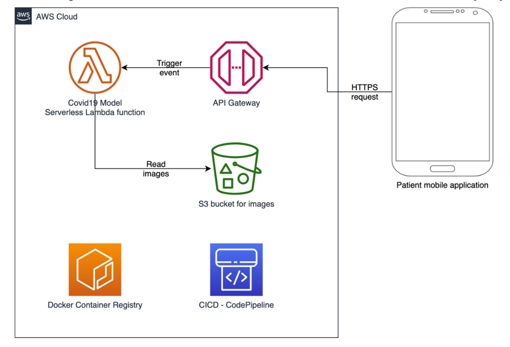

# Medical App for COVID-19 Infection Diagnosis

## Project Goal

The goal of this application is to help the patient to know the initial diagnosis of his health condition and determine whether he is infected with the Corona virus or not.

## Project Features

1. User can determine the type of use
2. Doctor can add patients and their data
3. Doctor can store more than one check for the same patient
4. Doctor can search by the patient's name
5. Doctor can view patient's profile
6. Doctor can view patient's diagnoses
7. Doctor can delete patient's diagnoses
8. Doctor can delete patient's profile
9. Patient can store more than one check
10. Patient can view diagnoses
11. Patient can delete diagnoses

## Tools

### Frameworks

- Xamarin forms

### Programming Languages

- C#
### Database

- Sqlite

### Cloud Computing
- AWS (Amazon Web Services)

## System Architecture

The system follows a serverless architecture on Amazon Web Services (AWS), one of the major cloud providers. It consists of three main components that facilitate the decision-making process of identifying COVID-19 suspects based on CT-scan images.

### Mobile Application

**Description:**
Cross-platform mobile app designed for patients to scan their own CT-Scan images and securely upload them to the cloud.

### ML Model

**Description:**
Machine learning model for classification based on the uploaded images. It detects evidence of COVID-19 suspects using a trained model.

### CI/CD Pipeline

**Description:**
Continuous Integration Continuous Deployment (CI/CD) pipeline responsible for deploying the system components to the cloud. 

